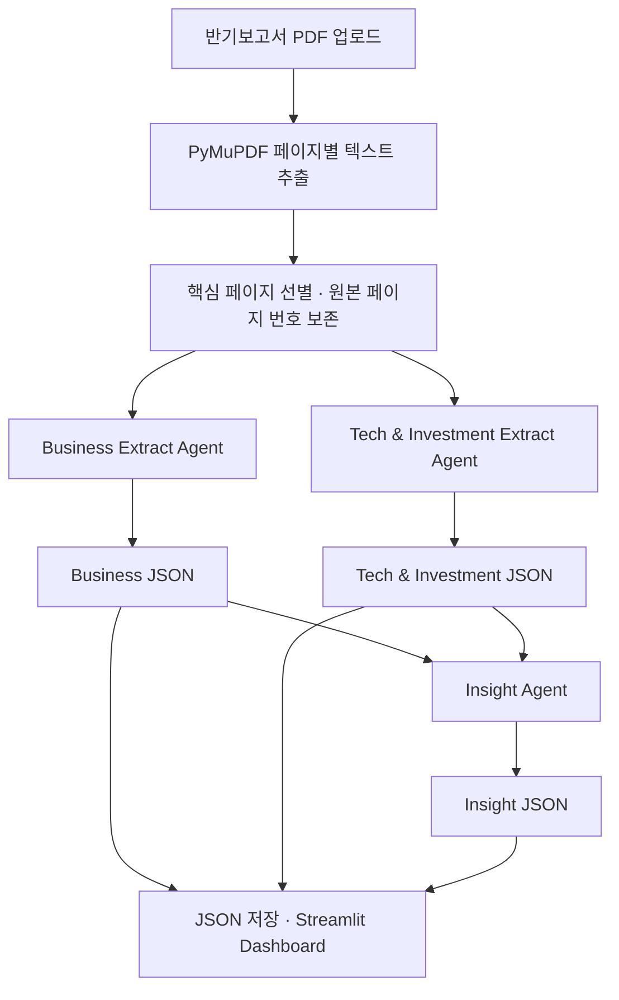

# DART Insight

**기업 공시 기반 취업·이직 정보 분석 서비스**

DART 반기보고서에서 취업 준비에 필요한 기업 정보를 추출·분석하는 AI 기업분석 서비스다. 주요 사업, 제품·서비스, 시장환경, 연구개발, 투자, 인력 현황을 구조화하고 기업 전략·산업 동향·기술 방향과 취업 인사이트를 제공하는 것을 목표로 한다.

> 현재는 **PDF 전처리와 Mock Agent 워크플로를 검증한 기초 구현 단계**다. Business/Tech 결과는 업로드 내용과 무관한 가상 예시이고, Insight는 두 JSON을 템플릿으로 종합한다. 실제 LLM 호출·공시 Fact 추출은 아직 연결되지 않았다. `USE_MOCK=false`나 API 키 입력만으로 실제 분석이 시작되지는 않는다.

## 1. 서비스 목적과 사용자

공시 보고서를 직접 읽고 정보를 정리하는 시간을 줄이고, 기업과 직무를 이해하는 데 필요한 근거를 제공한다.

- **취업준비생:** 지원 기업의 사업과 산업·기술 동향을 파악하고 자기소개서와 면접을 준비한다.
- **이직준비생:** 대상 기업의 사업 방향, 경영·인력 현황을 살펴보고 자신의 직무 경험과 연결할 정보를 찾는다.
- **주요 활용:** 지원 기업 탐색, 직무 이해, 자기소개서 작성, 면접 준비, 이직 대상 기업 조사.

취업 인사이트는 공시 Fact에 근거한 직무·기술 관련성 설명이다. 실제 채용 여부나 미래 실적을 단정하지 않는다.

## 2. 확정 기획 범위

### 1차 MVP

1. 사용자가 DART에서 내려받은 **반기보고서 PDF 한 개**를 Streamlit에 업로드한다.
2. Python·PyMuPDF로 페이지별 텍스트를 추출하고 원본 페이지 번호를 보존한다.
3. 사업·시장·연구개발·투자·생산·인력 관련 핵심 페이지를 선별해 두 Extract Agent 입력을 만든다.
4. **Business Extract Agent와 Tech & Investment Extract Agent가 병렬 분석**하고 각각 정의된 JSON Schema에 맞춰 결과를 구조화한다.
5. **Insight Agent는 두 Extract 결과 JSON을 종합**해 기업 전략, 산업 동향, 기술·투자 방향, 관련 직무·기술 키워드와 면접 활용 포인트를 생성한다.
6. 결과를 JSON으로 저장하고 Streamlit Dashboard에서 확인한다.

### 향후 제품화

- 기업명·기업 고유번호를 기준으로 **OpenDART API에서 보고서를 자동 탐색·수집**한다.
- 동일 기업의 당해·전년도 반기보고서를 같은 Schema로 분석한다.
- **Change Analysis**로 사업, 연구개발, 투자, 인력 등 주요 지표의 변화와 방향을 비교한다.

자동 수집과 전년도 비교는 현재 MVP에 구현되지 않은 후속 범위다. 1차 MVP의 입력은 사용자 업로드 PDF이며, 현재 Insight Agent에 비교 역할을 섞지 않는다.

## 3. 데이터 흐름과 Agent 역할



두 Extract 호출은 `ThreadPoolExecutor(max_workers=2)`로 병렬 실행한다. PDF 처리와 화면 갱신은 주 스레드에서 수행하고, 두 추출이 모두 성공해야 Insight를 실행한다. 어느 Agent든 실패하면 해당 실행의 결과 파일을 저장하지 않는다.

| Agent | 입력 | 담당 내용 | 출력 모델 |
|---|---|---|---|
| Business Extract | 사업·시장 관련 페이지 텍스트 | 기업 개요, 사업·제품·서비스, 시장환경·전망, 경쟁 요인, 판매 전략, 위험 | `BusinessResult` |
| Tech & Investment Extract | 기술·연구개발·투자·생산·직원 관련 페이지 텍스트 | 연구개발, 설비투자, 생산, 신사업, 인력 현황, 확인 가능한 재무 수치 | `TechResult` |
| Insight | 위 두 결과 JSON | 기업 전략, 산업·기술·투자 방향, 관련 직무·기술 영역, 취업 키워드, 면접 포인트 | `InsightResult` |

Insight 입력 계약은 다음과 같다. 원문 전체를 다시 전달하지 않는다.

```json
{"business": {}, "technology_and_investment": {}}
```

정확한 필드·타입·중첩 구조의 기준은 [schemas.py](schemas.py)다.

- **Business:** `company_name`, `report_period`, `business_summary`, `business_segments`, `major_products`(제품·서비스), `market_conditions`, `market_outlook`, `competitive_factors`, `sales_strategy`, `major_risks`.
- **Tech & Investment:** `revenue`, `operating_profit`, `rd_expense`, `rd_focus`, `rd_projects`, `major_investments`, `production_status`, `new_business`, `employee_count`, `employee_summary`, `technology_keywords`.
- **Insight:** `industry_trends`, `company_strategy`, `technology_focus`, `investment_direction`, `growth_signals`, `risk_signals`, `job_insights`, `job_keywords`, `interview_points`, `summary`.

`job_insights`는 `{job_area, reason, keywords, evidence}` 항목의 목록이며, `evidence`는 `{fact, source_page}` 목록이다. 수치가 없으면 `null`, 문자열은 `""`, 목록은 `[]`를 사용한다. 금액은 단위를 보존한 문자열을 권장한다. Pydantic으로 잘못된 타입·추가 필드·비정상 페이지 번호를 거부한다. **형식 검증은 사실 정확도 검증을 대신하지 않는다.**

## 4. 현재 구현 상태

| 기획 항목 | 상태 | 확인 내용 |
|---|---|---|
| PDF 업로드·페이지별 텍스트 추출 | 구현 | PyMuPDF, 한글 텍스트, 원본 페이지 번호 |
| 핵심 영역 선별 | 구현 | 책갈피 → 페이지 상단 장/절 제목 → 키워드·앞뒤 1페이지 순으로 보완 |
| 두 Extract의 병렬 실행 | 구현 | 독립 입력으로 동시 실행, 완료 후 Insight 진행 |
| Extract의 실제 AI Fact 추출 | **미구현** | 고정 Mock JSON, 실제 Studio 통신 없음 |
| 두 JSON 기반 Insight | Mock 구현 | 입력 계약·스키마 검증·템플릿 종합, 실제 LLM 종합은 미연결 |
| JSON 저장·대시보드 | 구현 | 입력 TXT 2개, 결과 JSON 3개, 5개 탭 |
| 원문·근거 확인 | 기초 구현 | 실제 PDF 페이지 조회, 일부 구조화 항목의 `source_page` 표시 |
| Studio 업로드용 PDF 생성 | 보조 기능 구현 | 원문 배치를 유지한 두 PDF와 원본 페이지 대응표 |
| OpenDART 자동 수집·전년도 비교 | 향후 확장 | 현재 미구현 |

**판정:** 기초 워크플로는 갖춰져 있지만 실제 AI 분석을 수행하는 1차 MVP는 아직 완성되지 않았다. 실제 통신과 원문 대비 추출 정확도 검증이 남아 있다. 기획 대조 및 수정 결과는 [점검 보고서](docs/plan-alignment-report.md)에 기록한다.

## 5. 실행 방법

Python **3.11 이상**과 PowerShell 기준이다. 프로젝트 루트에서 실행한다.

```powershell
# 가상환경이 없는 경우에만 생성
py -3.11 -m venv .venv

.\.venv\Scripts\python.exe -m pip install -r requirements.txt

# 기존 .env를 덮어쓰지 않는다.
if (!(Test-Path .env)) { Copy-Item .env.example .env }

$env:USE_MOCK = "true"
.\.venv\Scripts\python.exe -m streamlit run app.py
```

1. 브라우저에서 반기보고서 PDF를 업로드한다. 동작 확인용 파일은 `data/sample_report.pdf`다.
2. **기업 분석하기**를 누른다.
3. 기업 개요 / 산업 동향 / 기술 & 투자 / 취업 인사이트 / 근거·원문 탭을 확인한다.
4. `output/`에 저장된 JSON과 입력 TXT를 확인한다.

Mock 경고가 표시되는 동안 기업 분석 결과는 가상 예시다. 근거 탭의 Mock Fact·Page도 업로드 기업의 근거가 아니다. 같은 탭의 실제 원문 영역에서 업로드한 PDF의 페이지 텍스트를 별도로 확인할 수 있다.

### 환경변수

| 이름 | 용도 |
|---|---|
| `USE_MOCK` | 기본 `true`. 현재 실행 가능한 분석 모드는 Mock |
| `UPSTAGE_API_KEY` | 후속 실제 Studio 연결용 인증 설정 |
| `BUSINESS_AGENT_ID`, `TECH_AGENT_ID`, `INSIGHT_AGENT_ID` | 각 원격 Agent 식별 설정 |
| `UPSTAGE_AGENT_API_URL` | 실제 통신 구현 시 확인할 endpoint 설정 |
| `DART_API_KEY`, `*_CONFIG_ID` | `.env.example`의 후속 단계용 예시. 현재 코드에서 읽거나 사용하지 않음 |

환경변수는 `.env`보다 우선한다. 실제 키는 소스나 Git에 넣지 않는다. 현재 `agent_client.py`는 설정 누락 또는 실제 연결 미구현을 안내하며, API 실패를 Mock 성공으로 바꾸지 않는다.

## 6. 전처리와 결과 저장

- **원천 데이터:** 사용자가 올린 DART 반기보고서 PDF.
- **전처리 데이터:** 페이지별 추출 텍스트와 물리적 페이지 번호.
- **Agent 입력:** Business용·Tech & Investment용 핵심 텍스트. 공통 회사 소개 등은 중복 포함될 수 있다.
- **분석 결과:** 검증된 세 결과 JSON과 Streamlit Dashboard.

텍스트에는 `===== PAGE N =====` 마커를 붙인다. N은 **PDF 파일의 1부터 시작하는 원본 페이지 번호**이며, 보고서 하단에 인쇄된 쪽수와 다를 수 있다.

Business에는 회사 소개와 사업의 내용 장을, Tech에는 관련 연구개발·설비 절, 요약재무정보, 직원 현황 등을 선별한다. 장/절을 식별하지 못하면 키워드와 앞뒤 1페이지를 사용하고 경고한다. 범주별 입력 길이는 최대 **120,000자**이며 초과분은 제외하고 경고한다. 이 값은 문자 수 제한이며 모델 토큰 한도가 아니다.

```text
output/
├── business_input.txt
├── tech_input.txt
├── business_result.json
├── tech_result.json
└── insight_result.json
```

UTF-8로 저장하며 최신 성공 실행으로 덮어쓴다. Agent 실패 시 저장하지 않고, 파일 교체 중 일반적인 I/O 오류가 발생하면 이미 교체한 파일을 복원한다. 단일 사용자 로컬 실행을 전제로 하며 다중 사용자 동시 저장이나 강제 종료 시 복구를 보장하지 않는다.

### Studio Agent 준비용 보조 기능

업로드 후 **Studio용 PDF 만들기**를 누르면 Agent 호출 없이 다음 파일을 생성·다운로드한다. 기존 보조 기능이며 실제 분석 완료를 의미하지 않는다.

- `business_input.pdf`, `tech_input.pdf`: 선별 페이지의 원문 표와 배치를 보존한다.
- `manifest.json`: 원본 파일명·SHA-256·선별 방법·원본 페이지 대응표·경고를 담는다.

`output/studio_inputs/report-<id>/`에 실행별로 저장한다. PDF 상단 `SOURCE PDF PAGE N`의 N을 근거 페이지로 사용한다. 새 파일의 `FILE PAGE`와 구분한다. PDF 출력에는 120,000자 제한을 적용하지 않지만 선별에서 제외된 페이지는 포함되지 않는다.

```powershell
.\.venv\Scripts\python.exe preprocessor.py "data/sample_report.pdf"
```

`--output-dir`로 저장 상위 경로를 지정할 수 있다. 프롬프트와 연결 준비 절차는 [Agent 설정 안내](agent_configs/README.md)를 참고한다.

## 7. 프로젝트 구조

```text
app.py                  # Streamlit UI, 병렬 Extract → Insight, 결과 저장
preprocessor.py         # PDF 추출·페이지 선별·Studio PDF 내보내기
business_agent.py       # Business Mock / 원격 호출 Wrapper
tech_agent.py           # Tech & Investment Mock / 원격 호출 Wrapper
insight_agent.py        # 두 JSON 기반 Mock 종합 / 원격 호출 Wrapper
agent_client.py         # 실제 Studio 통신 연결 지점 (현재 미구현)
schemas.py              # 세 결과의 Pydantic JSON 계약
config.py               # 환경변수·입력 길이 설정
agent_configs/README.md # 프롬프트 초안·출력 규칙·연결 안내
tests/                  # 전처리·Agent·워크플로·Streamlit 테스트
data/sample_report.pdf  # 가상 기업 테스트 샘플
docs/                   # 구현 이력·기획 대조 보고
```

의존성은 Streamlit, PyMuPDF, python-dotenv, Pydantic, Requests다. Requests는 후속 통신용이며 현재 외부 요청은 수행하지 않는다.

## 8. 검증과 남은 완료 조건

```powershell
.\.venv\Scripts\python.exe -m unittest discover -s tests -v
```

자동 테스트는 실제 PDF 추출, 페이지 선별·길이 제한, Schema 검증, 두 Extract의 동시 실행, Insight 입력 계약, 실패 시 저장 방지·복원, 업로드 교체·오류·재시도·5개 탭을 확인한다. Streamlit AppTest에서는 파일 업로드 객체를 대체한다. 실제 API 응답과 추출 정확도는 검증하지 않는다.

실제 AI 연동(Phase 3)과 MVP 완료를 위해 남은 작업:

- [ ] 사용하는 Studio의 endpoint·인증·요청/응답 사양과 세 Agent 설정을 확정한다.
- [ ] `agent_client.py`에 실제 호출, 타임아웃, HTTP 오류, JSON 응답 처리를 구현한다.
- [ ] Business·Tech가 업로드 문서의 실제 Fact를 추출하고 Insight가 그 근거로 종합하는지 검증한다.
- [ ] 기업명, 보고기간, 숫자·단위, 원본 페이지, 핵심 영역의 누락과 인사이트 근거를 원문과 대조한다.
- [ ] 실제 Agent 응답으로 Dashboard와 JSON 저장까지 종단간 검증한다.

현재의 주요 한계:

- 스캔 전용 PDF의 OCR은 지원하지 않는다. 일부 이미지·표 내용도 텍스트 추출 과정에서 빠지거나 배열이 달라질 수 있다.
- 선별 규칙은 보고서 형식에 따라 누락이 생길 수 있다. 120,000자 초과 시 후반부 정보가 제외된다.
- 페이지가 선별되지 않은 범주는 빈 텍스트가 된다. Mock은 이 경우에도 데모 데이터를 반환하므로 추출 성공으로 해석하지 않는다.
- 일부 문자열·단일 수치 필드에는 개별 출처 필드가 없다. 현재 근거 표시는 출처가 있는 구조화 항목 중심이며 전체 Fact 추적을 보장하지 않는다.
- 실제 Agent의 근거 충실도, 분석 품질, 호출 시간·비용은 아직 평가하지 않았다.

OpenDART 자동 수집과 Change Analysis는 위 실제 AI MVP 검증 이후의 제품화 단계로 진행한다.
